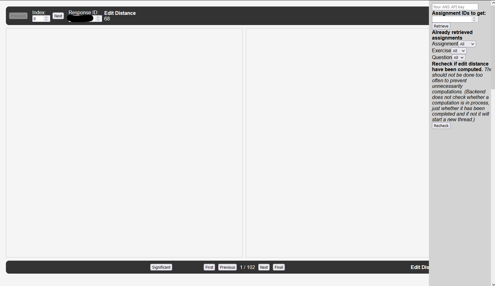

# Fraud detection program
A program to assist teachers in detection plagiarized answers for assignments given on [ans.app](https://www.ans.app/). 
This program was created for my master thesis.

This program is very early and misses features. 
Some processes might not work ideally (e.g. having to check the backend console for progress reports)
and crashes could occur.

## How to run
### Requirements
To run to program you need to following programs:
1. Git (to clone the repo)
2. Recommended: some version of Conda (e.g. miniconda) to create a virtual environment. Otherwise, python 3.10 needs to be installed.

### Installation
1. Open a terminal (or cmd if on Windows).
2. Clone this repo.
    ```
    git clone https://github.com/ValentijnvdB/Fraud_Detection_Program.git
    cd ./Fraud_Detection_Program
    ```
3. Create and activate a virtual environment (optional, but recommended).
    ```
    conda create detection_venv python=3.10
    conda activate detection_venv
    ```
4. Install the dependencies.
    ```
    pip install -r requirements.txt
    ```
5. Run ``app.py``. The possible arguments can be found below.
   ```
   python app.py <args>
   ```
6. Open a browser and go to ``http://localhost:5000``

### Arguments
If the argument is not provided, the default value is used.

| **Argument** | **Alias**       | **DEFAULT**            | **Description**                                                              |
|--------------|-----------------|------------------------|------------------------------------------------------------------------------|
| -h           | --help          |                        | Shows a help message                                                         |
| -p PORT      | --port PORT     | 5000                   | The port that will be used to connect open the frontend                      |
| -s SERVER    | --server SERVER | https://ans.app/api/v2 | The API server, where the responses will be retrieved from                   |
| -d DELAY     | --delay DELAY   | 0.2                    | The delay in seconds between API calls, when retrieving responses from ANS.  |
| -pl PL       | -pagelimit PL   | 20                     | ANS uses a page limit for its API. The page limit must be between 0 and 100. |
|              | --debug         |                        | Will log more verbosely, for debug purposes.                                 |


## How to use
In the right sidebar, give your ANS apikey and a list of assignment ids that you want to retrieve, then press 'Retrieve'.
The backend console will indicate the progress. Once a response is retrieved, the edit distance will automatically be computed.
After all edit distances have been computed, reload the page. 

Under 'Already retrieved assignments', you can filter responses that are part of a certain assignment, exercise or question.

Additionally, on the top right (not visible in the screenshot below) you can select between three HTML processing options:
- **Strip**: This is default and used during the computation of the edit distances. All html tags are removed from the answer.
- **Keep**: Will keep the responses as is. Any HTML formatting that is present in the response will be visible.
- **Show**: Will escape '<' and '>', so the raw HTML become visible.

Notes:
- If the retrieval is interrupted, for example because the program exited, then you need to restart the progress from the start.
- If all responses were retrieved, but not all edit distances were computed (for example because the program crashed), then restart the program and use the 'Recheck' button to restart the computation threads.



